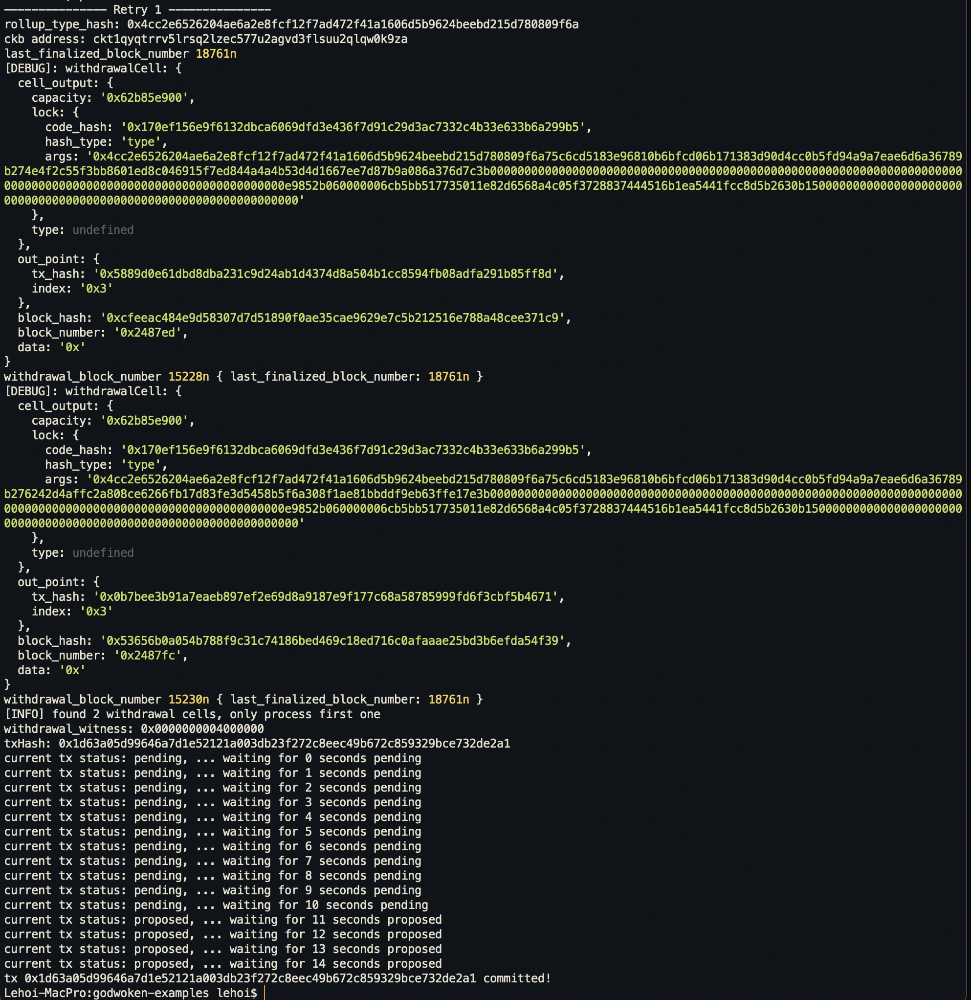

# Gitcoin: 10) Complete Withdrawal Process By Unlocking The Funds

## 1. A screenshot of the console output immediately after running the "unlock" command.

## 2. The Ethereum address that you've used for your Layer 2 account

`0xB53363c93A152e82851C15a89BfDc209B49d321E`

## 3. The Nervos Layer 1 address associated with the private key passed to "unlock" command. This is "ckb address" in the console output.

`ckt1qyqtrrv5lrsq2lzec577u2agvd3flsuu2qlqw0k9za`
