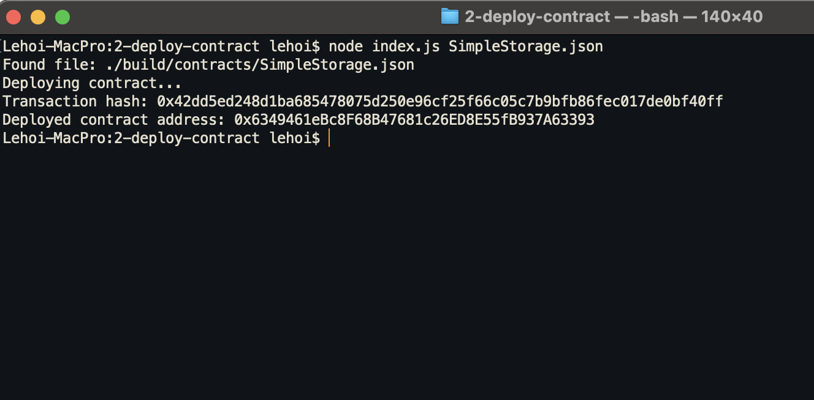

# Gitcoin: 2) Deploy A Simple Ethereum Smart Contract On Polyjuice

## 1. A screenshot of the console output immediately after you have successfully deployed a smart contract.

## 2. The transaction hash from the contract deployment
0x42dd5ed248d1ba685478075d250e96cf25f66c05c7b9bfb86fec017de0bf40ff

## 3. The deployed contract address from the contract deployment
0x6349461eBc8F68B47681c26ED8E55fB937A63393
