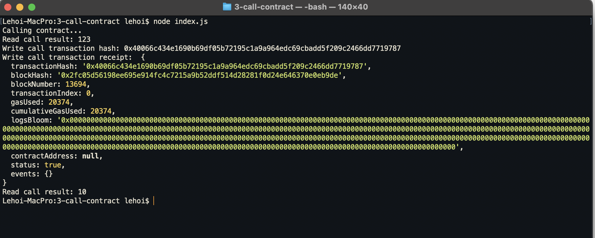

# Gitcoin: 3) Issue A Smart Contract Call To The Deployed Smart Contract


## 1. A screenshot of the console output immediately after you have successfully issued a smart contract call.



## 2. The transaction hash from the console output
0x40066c434e1690b69df05b72195c1a9a964edc69cbadd5f209c2466dd7719787

## 3. The contract address that you called
0x144899C293735ea5162259c8E0501a1eEeE33F31


## 4. The ABI for contract you made a call on

```json
 [
    {
      "inputs": [],
      "stateMutability": "payable",
      "type": "constructor"
    },
    {
      "inputs": [
        {
          "internalType": "uint256",
          "name": "x",
          "type": "uint256"
        }
      ],
      "name": "set",
      "outputs": [],
      "stateMutability": "payable",
      "type": "function"
    },
    {
      "inputs": [],
      "name": "get",
      "outputs": [
        {
          "internalType": "uint256",
          "name": "",
          "type": "uint256"
        }
      ],
      "stateMutability": "view",
      "type": "function"
    }
  ];
```