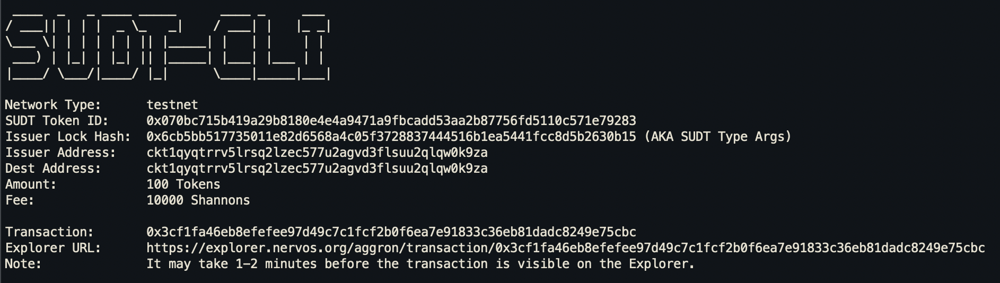
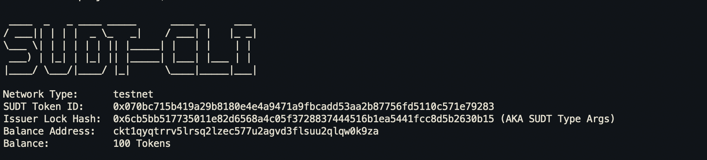

# Gitcoin: 4) Issue An SUDT Token On Layer 1 And Deposit It To Layer 2

## 1. A link to the Layer 1 address you funded on the Testnet Explorer.
[https://explorer.nervos.org/aggron/address/ckt1qyqtrrv5lrsq2lzec577u2agvd3flsuu2qlqw0k9za](https://explorer.nervos.org/aggron/address/ckt1qyqtrrv5lrsq2lzec577u2agvd3flsuu2qlqw0k9za)

## 2. A screenshot of the console output immediately after using sudt-cli to create your SUDT tokens on Layer 1.

## 3. A link to the transaction ID created by sudt-cli on the Testnet Explorer.
[https://explorer.nervos.org/aggron/transaction/0x3cf1fa46eb8efefee97d49c7c1fcf2b0f6ea7e91833c36eb81dadc8249e75cbc](https://explorer.nervos.org/aggron/transaction/0x3cf1fa46eb8efefee97d49c7c1fcf2b0f6ea7e91833c36eb81dadc8249e75cbc)

## 4. A screenshot of the console output immediately after you have successfully submitted a deposit to Layer 2 using the account-cli tool.

## 5. The SUDT ID from the console output after executing the deposit script.
