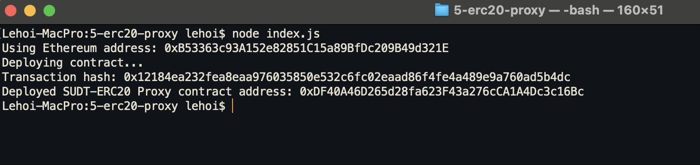
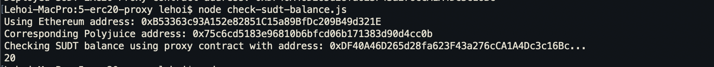

# Gitcoin: 5) Deploy The ERC20 Proxy Contract For The Deposited SUDT

## 1. A screenshot of the console output immediately after deploying smart contract.

## 2. The address of the ERC20 Proxy Contract you deployed
0xDF40A46D265d28fa623F43a276cCA1A4Dc3c16Bc

## 3. A screenshot of the console output immediately after checking your SUDT balance.

## 4. The Ethereum address that was checked
0xB53363c93A152e82851C15a89BfDc209B49d321E