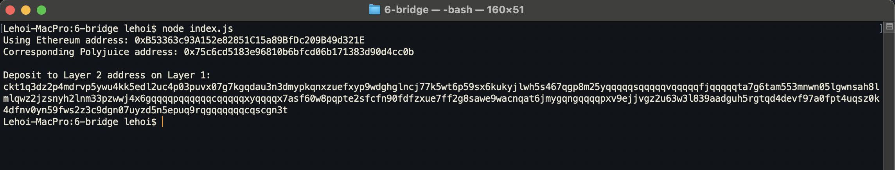

# Gitcoin: 6) Use Force Bridge To Deposit Tokens From Ethereum To Polyjuice

## 1. A screenshot of the console output immediately after you have successfully generated your Deposit Receiver Address.

## 2. Your Deposit Receiver Address
`ckt1q3dz2p4mdrvp5ywu4kk5edl2uc4p03puvx07g7kgqdau3n3dmypkqnxzuefxyp9wdghglncj77k5wt6p59sx6kukyjlwh5s467qgp8m25yqqqqqsqqqqqvqqqqqfjqqqqqta7g6tam553mnwn05lgwnsah8lmlqwz2jzsnyh2lnm33pzwwj4x6gqqqqpqqqqqqcqqqqqxyqqqqx7asf60w8pqpte2sfcfn90fdfzxue7ff2g8sawe9wacnqat6jmygqngqqqqpxv9ejjvgz2u63w3l839aadguh5rgtqd4devf97a0fpt4uqsz0k4dfnv0yn59fws2z3c9dgn07uyzd5n5epuq9rqgqqqqqqcqscgn3t`

## 3. The Ethereum address used to generate the Deposit Receiver Address
`0xB53363c93A152e82851C15a89BfDc209B49d321E`

## 4. A link to the Etherscan explorer for the successful Force Bridge transaction. This can be found on Force Bridge under History→Succeed.
[https://rinkeby.etherscan.io/tx/0x098cebf7f388d7ccc6c32cabda3fd706e464abdfcbaeaae2c100ab9d1e69c520](https://rinkeby.etherscan.io/tx/0x098cebf7f388d7ccc6c32cabda3fd706e464abdfcbaeaae2c100ab9d1e69c520)

## 5. A link to the Nervos explorer for the successful Force bridge transaction. This can be found on Force Bridge under History→Succeed.
[https://explorer.nervos.org/aggron/transaction/0x2131fef7cc7f0667c7bd1c98aa8f2e3592959e5d4818551378acf788ed148465](https://explorer.nervos.org/aggron/transaction/0x2131fef7cc7f0667c7bd1c98aa8f2e3592959e5d4818551378acf788ed148465)