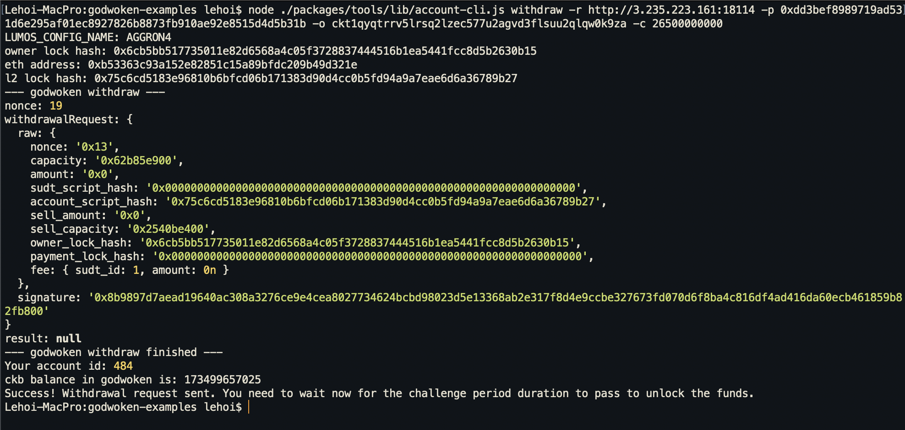

# Gitcoin: 9) Initiate a Withdrawal From Layer 2 Back to Layer 1

## 1. A screenshot of the console output immediately after running the withdraw command.

## 2. The Ethereum address that you've used for your Layer 2 account.

`0xb53363c93a152e82851c15a89bfdc209b49d321e`

## 3. The Nervos Layer 1 address that you p

`ckt1qyqtrrv5lrsq2lzec577u2agvd3flsuu2qlqw0k9za`